# SeatSync — Concurrent Event Ticket Booking

SeatSync is a full-stack event booking platform in the spirit of BookMyShow or Ticketmaster, with a deliberately minimal interface. Its core engineering problem is **safe concurrent seat booking**: when hundreds of people try to take the same seat at the same moment, exactly one of them gets it, and nobody ever ends up with half a booking.

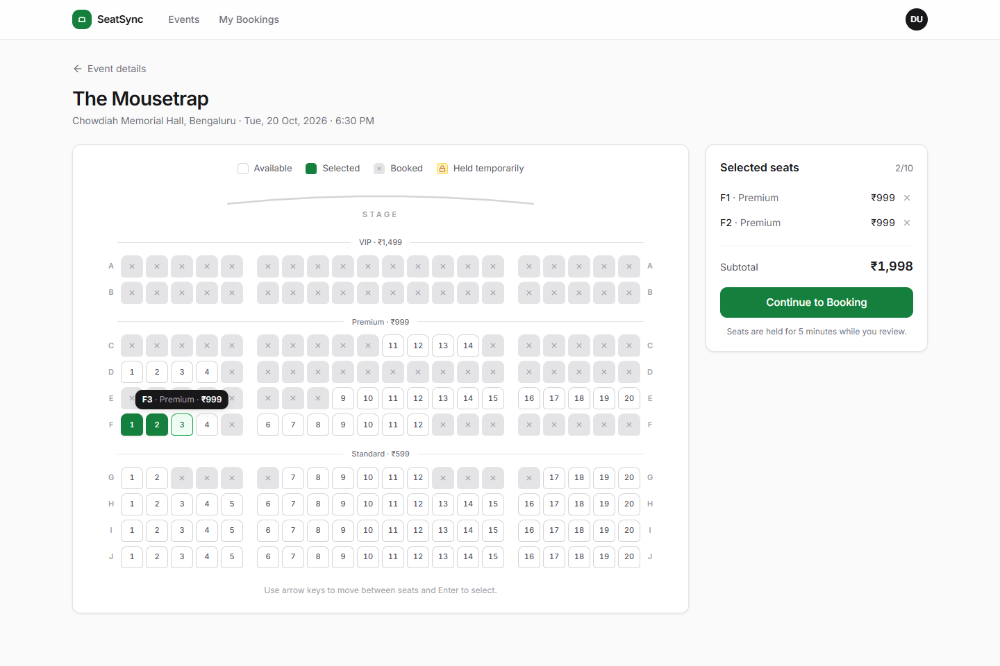

- **Discover → choose → book** flow with a live, keyboard-accessible seat map
- **Two interchangeable locking strategies** (optimistic `@Version`, pessimistic `SELECT … FOR UPDATE`) behind one switch, so they can be benchmarked
- **Database-level guarantees** (unique and partial unique indexes, check constraints) as a second safety layer
- **Real-time availability** over Server-Sent Events, with polling as a fallback
- **Proof, not claims**: 100-thread race tests against real PostgreSQL, and a 500-user JMeter plan with a double-booking verification script

---

## Contents

- [Architecture](#architecture)
- [Tech stack](#tech-stack)
- [The concurrency problem](#the-concurrency-problem)
- [Running locally](#running-locally)
- [API overview](#api-overview)
- [Database schema](#database-schema)
- [Testing strategy](#testing-strategy)
- [Load testing](#load-testing)
- [Security notes](#security-notes)
- [Screenshots](#screenshots)

---

## Architecture

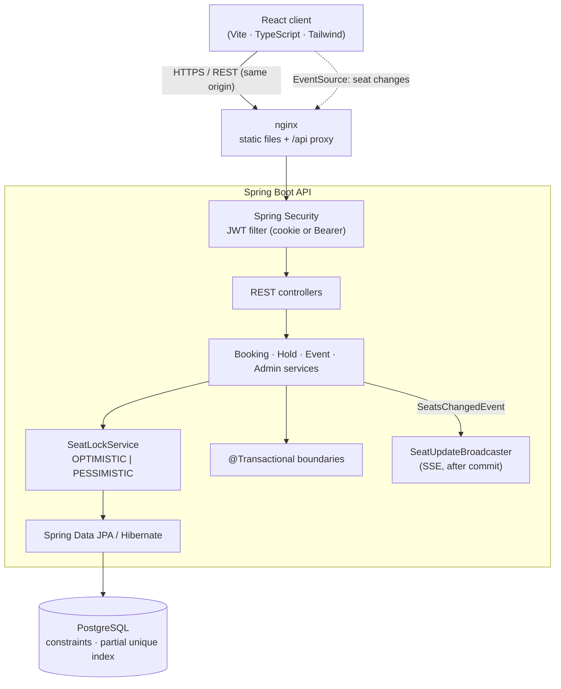

The backend follows a strict layering: **Controller → Service → Repository → PostgreSQL**. Controllers only translate HTTP. Business rules live in services. Repositories own queries and locks. Entities are never serialised; every response is a DTO.

```
backend/src/main/java/com/seatsync
├── config/        Security, properties, clock
├── controller/    Thin REST controllers
├── dto/           Request/response records (auth, event, seat, booking, admin)
├── entity/        JPA entities: User, Event, Seat (@Version), Booking (@Version), BookingSeat
├── exception/     Domain exceptions + @RestControllerAdvice
├── mapper/        Entity → DTO mapping
├── repository/    Spring Data repositories, specifications, projections
├── security/      JWT service, filter, cookie factory, JSON 401/403 handlers
├── seed/          Dev-profile data seeder (50 events × 200 seats)
└── service/       Booking, holds, events, admin, locking, realtime, layout
```

### Booking flow

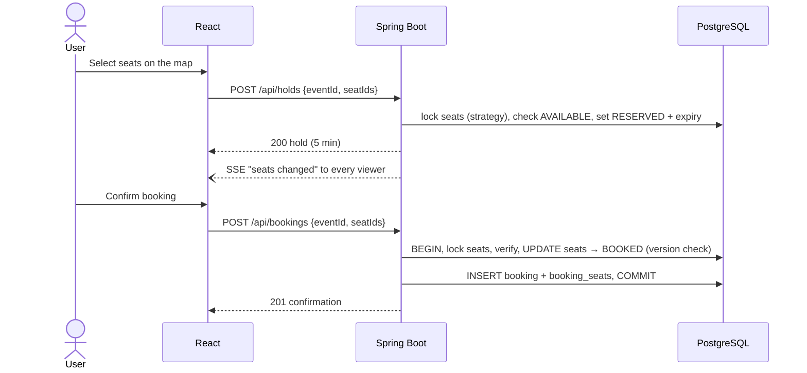

---

## Tech stack

| Layer | Choices |
|---|---|
| Frontend | React 19, TypeScript, Vite, Tailwind CSS v4, React Router, TanStack Query, Lucide icons, Recharts (admin chart only, lazy-loaded) |
| Backend | Java 21, Spring Boot 3.5 (Web MVC, Data JPA, Security, Validation, Actuator), Hibernate 6, JJWT, Flyway |
| Database | PostgreSQL 16 |
| Testing | JUnit 5, Mockito, Spring Boot Test, MockMvc, Testcontainers, Apache JMeter |
| Delivery | Docker, Docker Compose, nginx, GitHub Actions |

---

## The concurrency problem

Two users open the same event and both click seat **A10**. Both requests arrive within milliseconds. A naive implementation does *read status → check AVAILABLE → write BOOKED*. Both reads see `AVAILABLE`, both writes succeed, and the seat is sold twice.

SeatSync closes that window at three levels.

### 1. One transaction, all or nothing

`BookingService.createBooking` is a single `@Transactional` unit:

1. Load the event and check that booking is open (on sale, not yet started)
2. **Acquire** the requested seats through the configured locking strategy, **in ascending id order**
3. Verify every seat is available to this user (free, their own hold, or a lapsed hold)
4. Mark seats `BOOKED` and **flush immediately**, so a stale version surfaces here rather than at commit
5. Insert the booking and its `booking_seats` lines, capturing each seat's price
6. Commit, then broadcast the change to live seat maps

If any seat is unavailable, conflicts, or violates a constraint, an exception is thrown and **the whole transaction rolls back**. No partial bookings are possible.

### 2. Optimistic locking (`@Version`) — default

```java
@Version
private long version;
```

Seats are read without locks. When the transaction flushes, Hibernate issues:

```sql
UPDATE seats SET status = 'BOOKED', version = 6 WHERE id = ? AND version = 5
```

If another transaction committed first, the version is already 6, the `UPDATE` matches **zero rows**, and Hibernate raises a stale-state exception. It surfaces as `ObjectOptimisticLockingFailureException`, which becomes:

```http
HTTP/1.1 409 Conflict
{ "status": 409, "error": "Booking Conflict", "message": "One or more selected seats are no longer available." }
```

In PostgreSQL's `READ COMMITTED` mode, the loser's `UPDATE` briefly waits on the winner's row lock, then re-checks `version = 5` against the committed row and fails. Optimistic locking is cheap when conflicts are rare, which is the common case: most users pick different seats.

### 3. Pessimistic locking (`SELECT … FOR UPDATE`)

```java
@Lock(LockModeType.PESSIMISTIC_WRITE)
@Query("select s from Seat s where s.event.id = :eventId and s.id in :seatIds order by s.id")
List<Seat> lockForBooking(Long eventId, Collection<Long> seatIds);
```

Competing transactions queue on the row lock. The first commits `BOOKED`; each waiter then reads the committed row, sees `BOOKED`, and gets a clean `409 "Seat A10 is no longer available."`. This is the better fit for flash-sale contention, where optimistic retries would burn work.

**Deadlock avoidance:** both strategies sort seat ids before touching rows, and Hibernate is configured with `order_updates=true`. Every transaction therefore acquires row locks in the same global order. A user booking `[A3, A1, A2]` and another booking `[A2, A3]` queue; they never deadlock. The concurrency suite requests shuffled, overlapping seat sets specifically to prove this.

**Choosing a strategy:** set `BOOKING_LOCKING_STRATEGY=OPTIMISTIC|PESSIMISTIC`. Tests call `createBooking(user, request, strategy)` directly to exercise both.

### 4. The database as the last line of defence

Even if application code were wrong, PostgreSQL refuses a double allocation:

| Constraint | Guarantees |
|---|---|
| `UNIQUE (event_id, seat_number)` | A seat never exists twice for an event |
| `UNIQUE (seat_id) WHERE active` on `booking_seats` | **A seat can belong to at most one active booking.** Cancelling flips `active` to false, freeing the seat |
| `CHECK` on seats | `RESERVED` ⇔ holder and expiry are set; valid status/section/price |
| `CHECK` on bookings | Valid status; `cancelled_at` present exactly when cancelled; non-negative totals |
| Foreign keys | Bookings ↔ users/events, lines ↔ bookings/seats |

A violation raises `DataIntegrityViolationException`, which is also mapped to `409`.

### Seat holds

"Continue to Booking" places a **5-minute hold** (`RESERVED`) using the same locking path, so others see the seat as temporarily locked (amber, with a lock icon) while the user reviews. Lapsed holds are treated as available immediately, and a scheduled sweeper cleans them up every 30 seconds via the partial index `ix_seats_hold_expiry`.

### Real-time availability

After a hold, booking, or cancellation **commits**, a `SeatsChangedEvent` is pushed to every open seat map over Server-Sent Events. Publishing on `AFTER_COMMIT` means clients never see uncommitted state. The browser refetches the map. If a seat the user had selected is gone, it is deselected with a specific message: *"Seat A10 was just booked by another user."* A 20-second poll covers dropped connections.

---

## Running locally

### Docker (everything)

```bash
cp .env.example .env        # optional: the defaults work for local use
docker compose up --build
```

| Service | URL |
|---|---|
| Web app | http://localhost:3000 |
| API | http://localhost:8080/api |
| PostgreSQL | localhost:5432 (`seatsync` / `seatsync`) |

The `dev` profile seeds on first start: **50 events × 200 seats = 10,000 seats**, about 1,800 bookings, 20 customers and 500 load-test accounts.

| Account | Email | Password |
|---|---|---|
| Admin | `admin@seatsync.dev` | `Admin@12345` |
| Customer | `demo@seatsync.dev` | `Demo@12345` |
| Load test | `loadtest1…500@seatsync.dev` | `LoadTest@123` |

Reset everything with `docker compose down -v`.

### Without Docker for the app

```bash
docker run -d --name seatsync-db -e POSTGRES_DB=seatsync -e POSTGRES_USER=seatsync \
  -e POSTGRES_PASSWORD=seatsync -p 5432:5432 postgres:16-alpine

cd backend && ./mvnw spring-boot:run -Dspring-boot.run.profiles=dev
cd frontend && npm install && npm run dev      # http://localhost:5173 (proxies /api → :8080)
```

### Configuration

All secrets come from the environment; see [`.env.example`](.env.example).

| Variable | Purpose |
|---|---|
| `DATABASE_URL`, `DATABASE_USERNAME`, `DATABASE_PASSWORD` | JDBC connection |
| `DATABASE_POOL_SIZE` | HikariCP pool size (default 20) |
| `JWT_SECRET` | HMAC key, at least 32 characters. Required outside the `dev` profile |
| `JWT_EXPIRATION` | Token lifetime, e.g. `24h` |
| `JWT_COOKIE_SECURE` | `true` behind HTTPS |
| `BOOKING_LOCKING_STRATEGY` | `OPTIMISTIC` (default) or `PESSIMISTIC` |
| `SPRING_PROFILES_ACTIVE` | `dev` seeds demo data |

---

## API overview

All endpoints are under `/api`. Errors share one shape:

```json
{ "timestamp": "2026-09-29T12:13:25Z", "status": 409, "error": "Booking Conflict", "message": "Seat A10 is no longer available." }
```

Validation failures add `fieldErrors: { "email": "Enter a valid email address" }`.

| Method | Endpoint | Access | Purpose |
|---|---|---|---|
| POST | `/auth/register` | Public | Create account, start session |
| POST | `/auth/login` | Public | Returns `{token, expiresAt, user}` and sets an HttpOnly cookie |
| POST | `/auth/logout` | Public | Clears the session cookie |
| GET | `/auth/me` | User | Current user |
| GET | `/events?q&category&city&from&to&page&size` | Public | Upcoming events with price range and availability |
| GET | `/events/filters` | Public | Categories and cities for filters |
| GET | `/events/{id}` | Public | Event details and per-section availability |
| GET | `/events/{id}/seats` | Public | Seat map (`heldByMe` when signed in) |
| GET | `/events/{id}/seats/stream` | Public | SSE stream of seat changes |
| POST | `/holds` | User | Hold seats for 5 minutes |
| DELETE | `/holds?eventId=` | User | Release your holds |
| POST | `/bookings` | User | Book seats (all or nothing), `201` or `409` |
| GET | `/bookings/me` | User | Your bookings, newest first |
| GET | `/bookings/{id}` | Owner/Admin | Booking details |
| DELETE | `/bookings/{id}` | Owner/Admin | Cancel (until 24h before the event) |
| GET | `/admin/dashboard` | Admin | Totals, 14-day ticket chart, recent bookings |
| GET/POST | `/admin/events` | Admin | List / create (seat layout generated) |
| GET/PUT/DELETE | `/admin/events/{id}` | Admin | Read / update (details, prices, open/pause) / delete |
| GET | `/admin/bookings?eventId&status` | Admin | All bookings |
| GET | `/admin/users` | Admin | Users with booking counts |

---

## Database schema

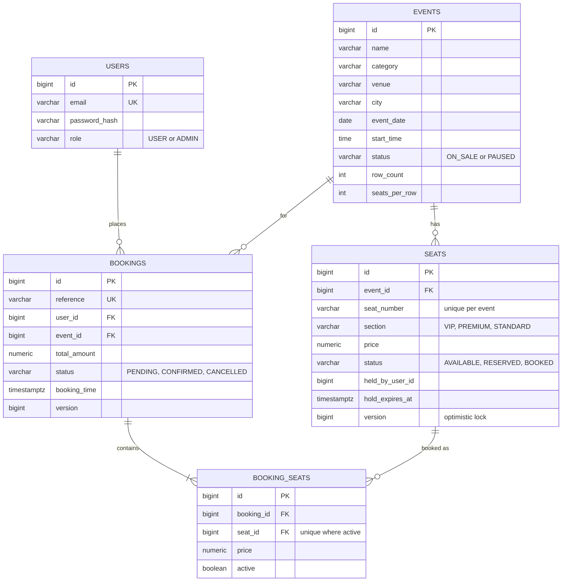

The schema is managed by Flyway ([`V1__initial_schema.sql`](backend/src/main/resources/db/migration/V1__initial_schema.sql)); Hibernate only validates it.

### Why each index exists

| Index | Serves |
|---|---|
| `ix_events_date_time (event_date, start_time)` | Event discovery: upcoming events ordered by date and time |
| `uk_seats_event_seat_number (event_id, seat_number)` | Integrity, plus every "seats of event X" lookup (leading column) |
| `ix_seats_event_status (event_id, status)` | Availability counts on event cards and admin monitoring, via index-only scans |
| `ix_seats_hold_expiry (hold_expires_at) WHERE status='RESERVED'` | The hold sweeper; tiny, because only held seats are indexed |
| `ix_bookings_user_time (user_id, booking_time DESC)` | "My bookings", already in display order |
| `ix_bookings_event_status (event_id, status)` | Admin filters and the "event has bookings" delete guard |
| `ix_bookings_time (booking_time DESC)` | Admin booking feed and the dashboard's daily chart |
| `ux_booking_seats_active_seat (seat_id) WHERE active` | The no-double-booking guarantee |

Other performance choices:
- The event list fetches seat statistics for a whole page in one grouped query.
- Booking lists load lines and seats in batches (`default_batch_fetch_size`), avoiding N+1 queries.
- Seat layouts are inserted with JDBC batching (`reWriteBatchedInserts`).
- `open-in-view` is off, and transactions stay short.

---

## Testing strategy

```bash
cd backend && ./mvnw verify      # needs Docker for Testcontainers
cd frontend && npm run lint && npm run build
```

**58 backend tests.** Integration and concurrency tests run against a real PostgreSQL 16 in Docker (Testcontainers). Row locks, version checks and partial indexes behave exactly as in production; H2 would not prove anything here.

| Suite | What it proves |
|---|---|
| `BookingServiceTest` (Mockito) | Successful booking and price total, whole-booking rejection when one seat is taken, other users' holds, version conflict → 409, unknown event, paused/started events, cancellation rules (owner only, 24h cutoff, no double cancel) |
| `SeatTest`, `BookingTest` | Hold/expiry rules, price capture and total calculation, cancellation releasing seats |
| `SeatLockServiceTest` | Ids sorted and de-duplicated before locking; each strategy uses the right query; stale flush → `BookingConflictException` |
| `JwtServiceTest` | Round trip, expiry, tampering, foreign keys |
| `SeatLayoutPlannerTest` | Unique seat numbers, VIP/Premium/Standard split, pricing |
| `AuthIntegrationTest` | Register, duplicate email, validation errors, login, HttpOnly cookie session, 401s |
| `BookingFlowIntegrationTest` | Browse → hold → book → **database state** → cancel → rebook; 409 with no partial booking; 400 validation; foreign seats |
| `AdminAuthorizationIntegrationTest` | USER gets 403 on admin APIs; admin creates events with generated seats, pauses sales, cannot delete events with bookings |
| **`SeatBookingConcurrencyTest`** | Run for **both** strategies: **100 threads → 1 booking, 99 conflicts**, `COUNT(confirmed bookings for seat) = 1`; 50 users on 50 different seats all succeed; 60 users with shuffled overlapping 3-seat sets → no deadlocks, every success all-or-nothing, zero double bookings |
| `LockingMechanismTest` | Deterministic demos: a stale `@Version` update is rejected; a `FOR UPDATE` lock makes a competing transaction wait, then see `BOOKED` |

### Concurrency results

Every line below is an exact assertion in `SeatBookingConcurrencyTest`, so a passing build means it held. Last local run: JDK 23 and PostgreSQL 16 in Docker, `Tests run: 58, Failures: 0, Errors: 0`.

| Test | Strategy | Asserted outcome |
|---|---|---|
| 100 users race for one seat | OPTIMISTIC | exactly 1 booked, 99 × 409, 0 unexpected errors, 1 confirmed booking for the seat |
| 100 users race for one seat | PESSIMISTIC | exactly 1 booked, 99 × 409, 0 unexpected errors, 1 confirmed booking for the seat |
| 50 users, 50 different seats | both | 50/50 booked, 0 conflicts |
| 60 users, shuffled overlapping 3-seat windows | both | 0 deadlocks or errors, booked seats = 3 × successful bookings, 0 double bookings |

---

## Load testing

The JMeter plan [`load-tests/seatsync-load-test.jmx`](load-tests/seatsync-load-test.jmx) runs **500 virtual users** with a **60 s ramp-up**. A setup step discovers bookable events and seat pools from the live API, so it works against any seeded database.

| Scenario | Users | Behaviour |
|---|---|---|
| A · Browse events | 200 | List pages and event details, 0.5–1.5 s think time, 3 minutes |
| B · Seat availability | 150 | Fetch random seat maps, 1–2 s think time, 3 minutes |
| C · Book different seats | 100 | Log in once, book 5 distinct free seats each |
| D · Contend for the same seats | 50 | All hammer the same 10 seats (5 s ramp, 3 attempts each) |

Booking samplers accept `201` or `409`. Conflicts are relabelled `… (409 conflict)`, so the report separates **error rate** (real failures) from **booking-conflict rate** (the system working as designed).

Requires Apache JMeter 5.6.x running on **Java 17 or 21**. JMeter 5.6.3 bundles Groovy 3, which cannot compile the plan's JSR223 scripts on Java 23+ (`Unsupported class file major version 67`); point `JAVA_HOME` at a 21 JDK/JRE for JMeter.

```bash
docker compose down -v && docker compose up --build -d     # fresh seeded database

jmeter -n -t load-tests/seatsync-load-test.jmx -l load-tests/results/results.jtl \
       -e -o load-tests/results/report                     # HTML dashboard: avg, P95, throughput, errors

node load-tests/summarize-results.mjs load-tests/results/results.jtl
./load-tests/verify-no-double-booking.sh                   # must print "No double bookings found."
```

Override with `-Jhost= -Jport= -Jrampup= -Jduration= -Jbrowse_users= -Jseat_users= -Jbooking_users= -Jcontention_users= -Jhot_pool_size=`. To compare strategies, restart the backend with `BOOKING_LOCKING_STRATEGY=PESSIMISTIC` on a fresh database and run again.

### Double-booking verification

```sql
SELECT seat_id, COUNT(*)
FROM booking_seats bs
JOIN bookings b ON b.id = bs.booking_id
WHERE b.status = 'CONFIRMED'
GROUP BY seat_id
HAVING COUNT(*) > 1;   -- expected: 0 rows
```

[`verify-no-double-booking.sh`](load-tests/verify-no-double-booking.sh) runs this and three more consistency checks (every `BOOKED` seat has exactly one confirmed booking, no confirmed line points at a free seat, totals match seat prices), and exits non-zero on any violation.

### Sample results

Measured on 29 Sep 2026 with the default `OPTIMISTIC` strategy. Everything ran on one Windows laptop: JMeter 5.6.3 (Java 21) plus the Docker Compose stack (Spring Boot, PostgreSQL 16, pool size 30), against a freshly seeded database. Treat these as a baseline, not a benchmark.

| Sampler | Samples | Avg (ms) | P95 (ms) | Throughput (req/s) | Error % | Conflict % |
|---|---:|---:|---:|---:|---:|---:|
| A · List events | 14,368 | 43 | 18 | 80.2 | 0 | 0 |
| A · Event details | 14,259 | 40 | 14 | 79.9 | 0 | 0 |
| B · Seat map (200 seats) | 14,377 | 54 | 15 | 80.7 | 0 | 0 |
| C · Book seat | 500 | 20 | 35 | 7.6 | 0 | 0 |
| D · Book contested seat | 150 | 75 | 526 | 34.9 | 0 | 93.33 |
| C/D · Login (BCrypt) | 150 | 112–195 | 155–423 | | 0 | 0 |
| **Total** | **43,804** | **46** | **18** | **243.8** | **0** | **0.32** |

- **0 errors** in 43,804 requests with 500 concurrent users.
- **Scenario D:** 50 users made 150 attempts on 10 seats. **Exactly 10 succeeded and 140 received `409 Conflict`**, which is precisely the number of seats available.
- **Scenario C:** 500 bookings of distinct seats, all `201`.
- Average is above P95 for the read endpoints because of a warm-up tail (cold JVM and connection pool, max 5.7 s in the first seconds). Steady-state reads stayed in the 5–20 ms range.
- Post-run verification:

```
  PASS  seats in more than one confirmed booking
  PASS  BOOKED seats without exactly one confirmed booking
  PASS  confirmed booking lines on non-BOOKED seats
  PASS  bookings whose total differs from seat prices

Confirmed bookings: 2212   Booked seats: 4631
No double bookings found.
```

---

## Security notes

- **Passwords** are hashed with BCrypt. Login does the same work for unknown emails, so response time doesn't reveal which accounts exist.
- **JWT in an HttpOnly cookie** (`SameSite=Lax`, `Path=/api`, `Secure` when `JWT_COOKIE_SECURE=true`). Page scripts can never read the token, which removes the main XSS token-theft risk of `localStorage`. The same token is also returned in the login body and accepted as `Authorization: Bearer` for API clients such as JMeter.
- **CSRF:** the API is stateless JSON. The `Lax` cookie is not sent on cross-site `POST`/`PUT`/`DELETE`, and nginx serves the app and API from one origin, so no CORS is enabled. Add CSRF tokens if the cookie must ever be sent cross-site.
- **Authorization** is enforced in the filter chain (`/api/admin/**` requires `ADMIN`). Ownership checks happen in services: users can only see or cancel their own bookings.
- **Validation** (`@NotBlank`, `@Email`, `@Size`, `@Positive`, …) rejects bad input before business logic runs.
- **Secrets** come from the environment. The committed defaults are clearly marked local-only.

---

## Screenshots

| | |
|---|---|
| 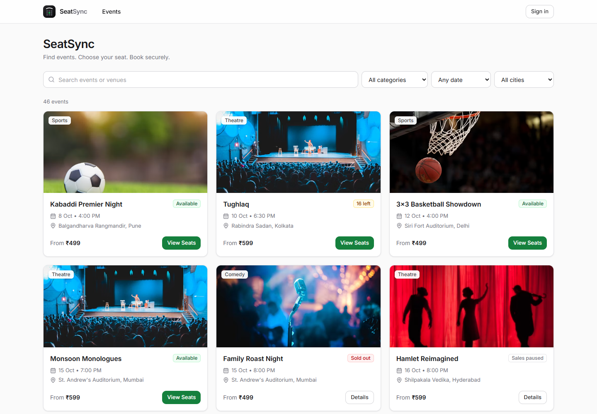 | 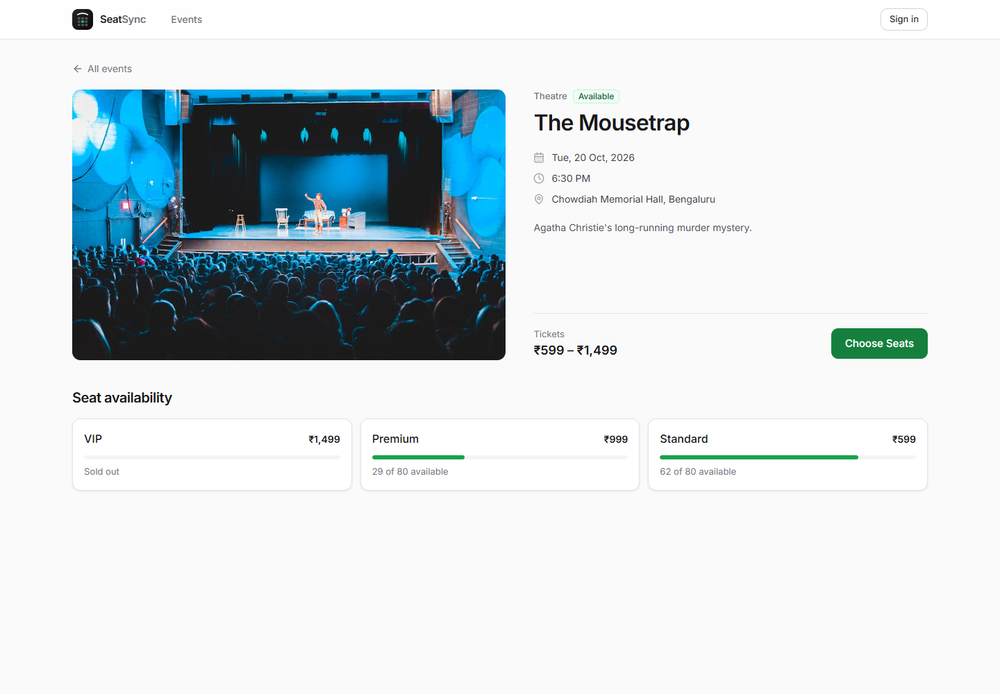 |
| **Discover events** | **Event details** |
| 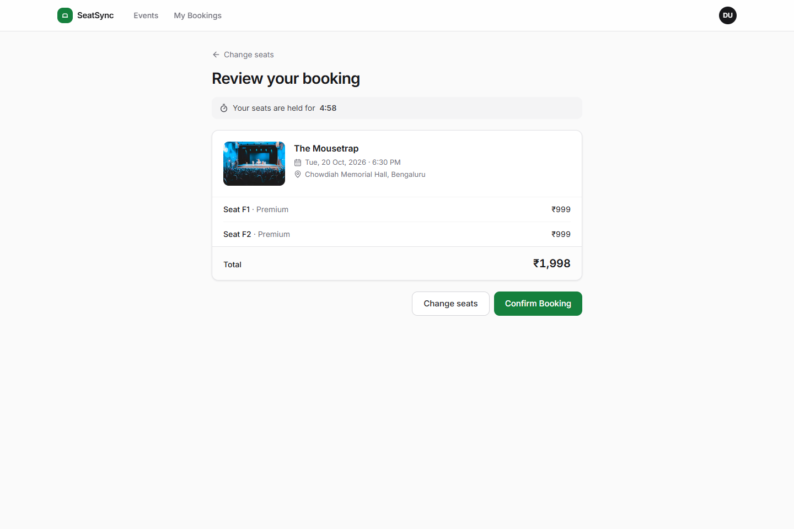 | 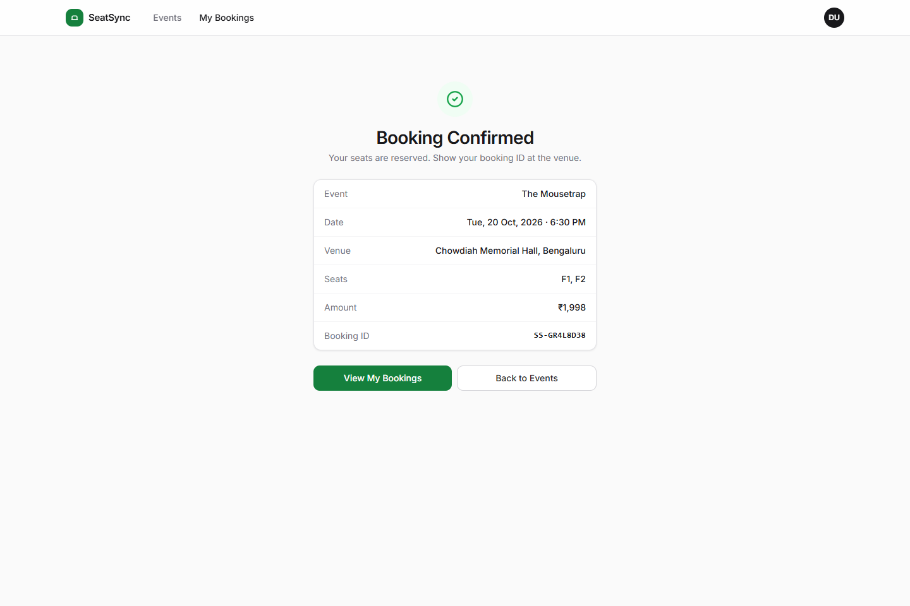 |
| **Review with hold countdown** | **Booking confirmed** |
| 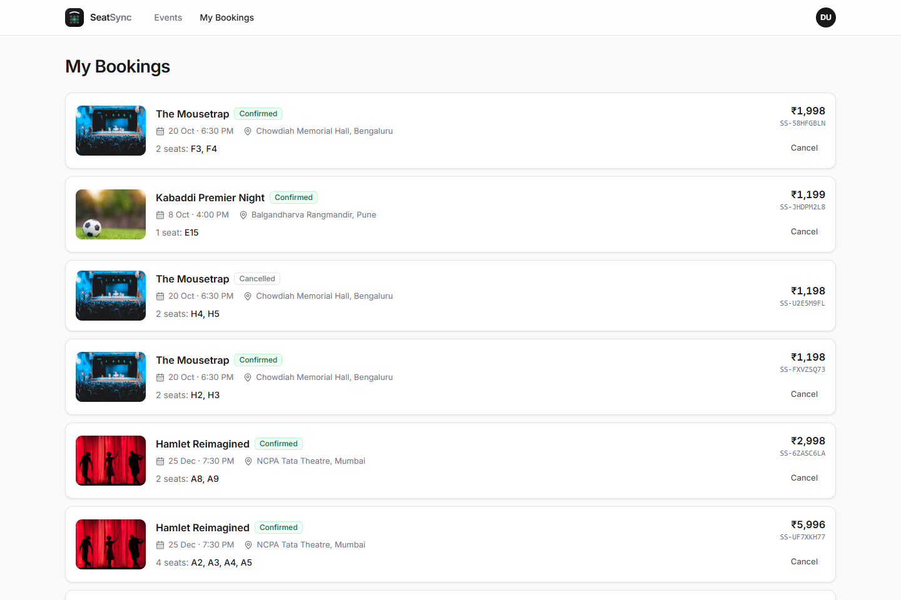 | 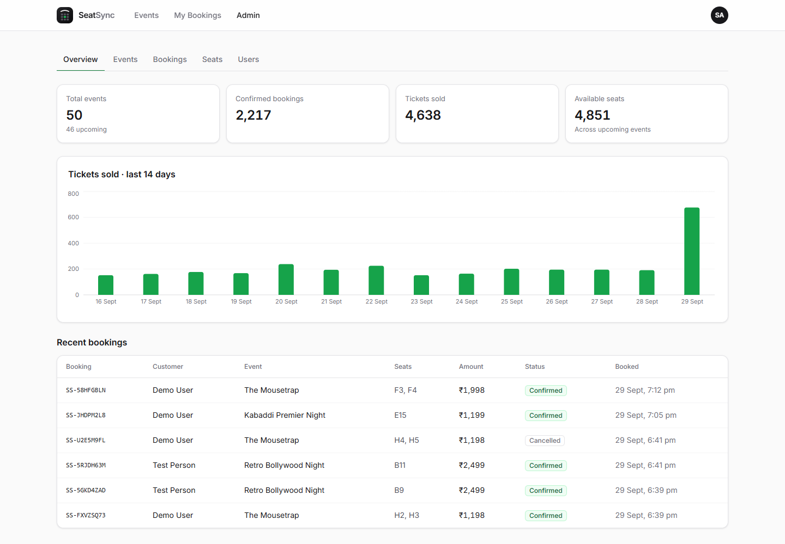 |
| **My bookings** | **Admin overview** |

<p align="center">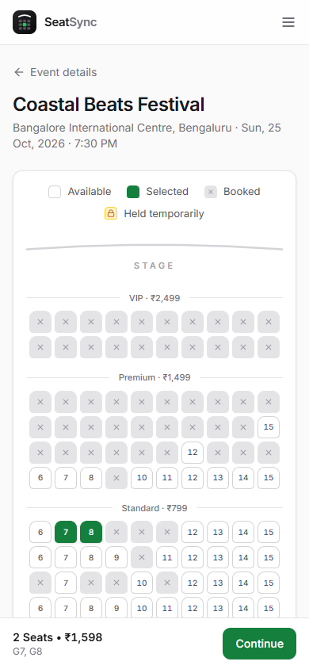<br/><b>Mobile: scrollable map and sticky booking bar</b></p>

---

## Project structure

```
.
├── backend/                 Spring Boot API (Maven wrapper, Dockerfile)
├── frontend/                React app (Vite, nginx Dockerfile)
├── load-tests/              JMeter plan, results summariser, double-booking checks
├── docs/screenshots/        UI screenshots used in this README
├── docker-compose.yml       postgres + backend + frontend
├── .env.example             Configuration template
└── .github/workflows/ci.yml Tests, lint, build, Docker images
```
